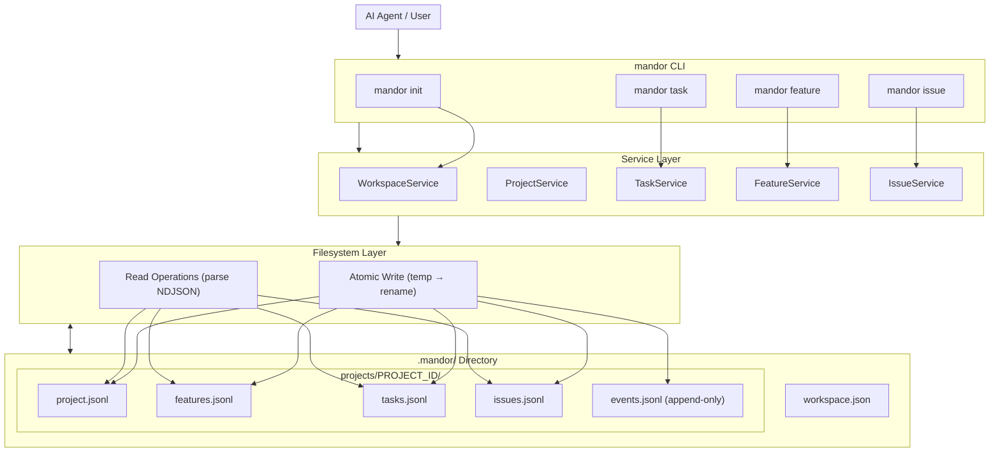
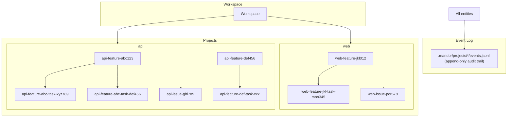
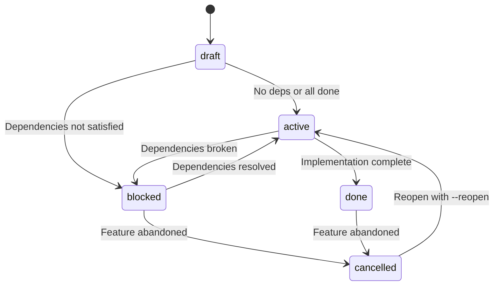
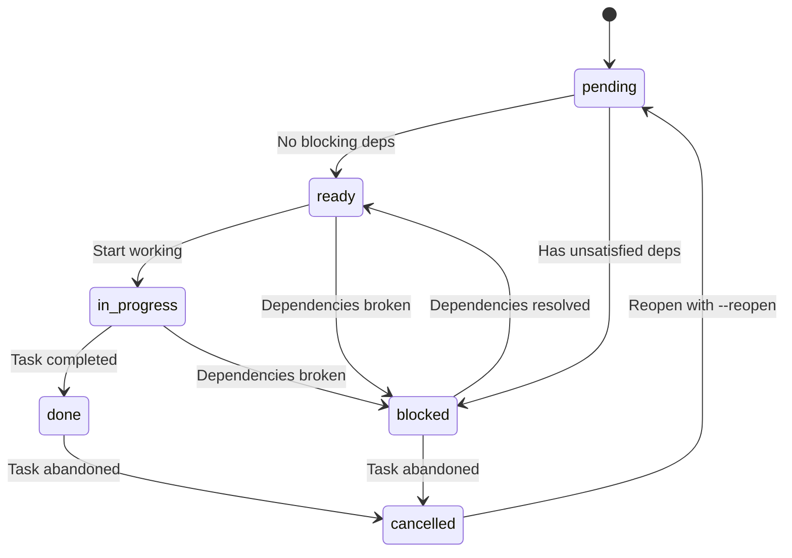
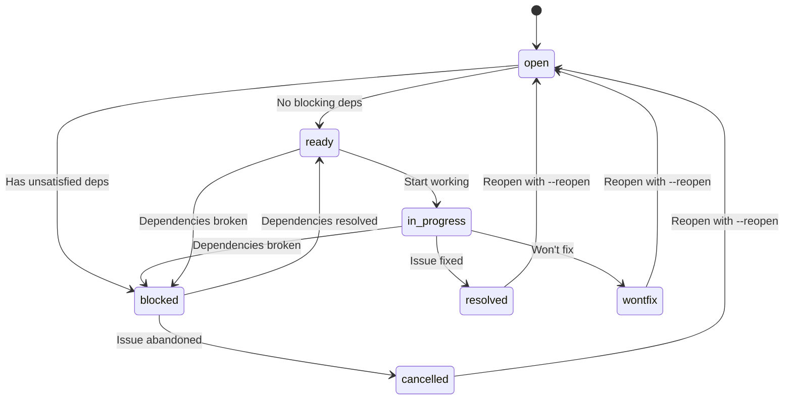
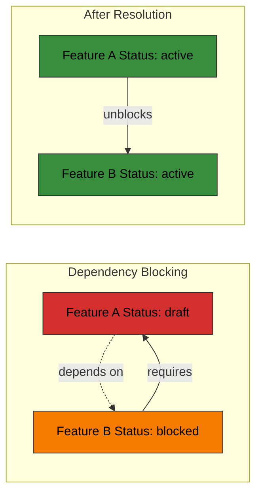
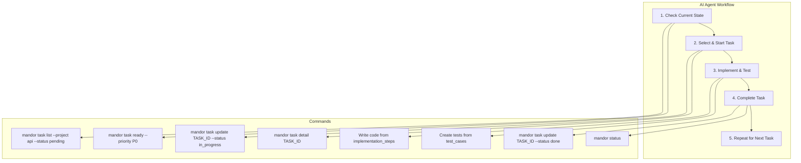
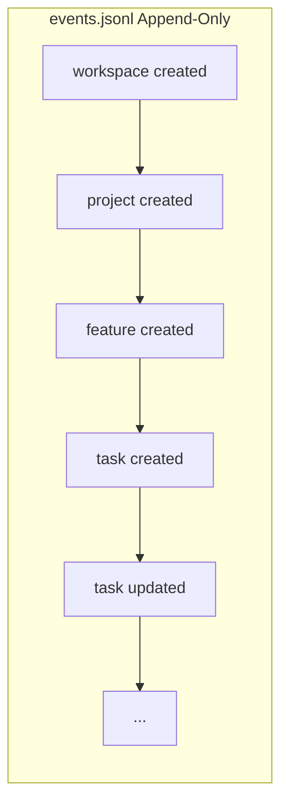

# Mandor - Event-Based Task Manager CLI for AI Agent Workflows

<p align="center">
  
</p>

<p align="center">
  <strong>Deterministic JSONL output | Streaming-native architecture | Schema-driven task management</strong>
</p>

<p align="center">
  <a href="#installation">Installation</a> •
  <a href="#quick-start">Quick Start</a> •
  <a href="#commands">Commands</a> •
  <a href="#entity-types">Entity Types</a> •
  <a href="#examples">Examples</a>
</p>

---

## Overview

Mandor is a CLI tool for managing tasks, features, and issues in AI agent workflows. It provides:

- **Event-Based Architecture**: All changes are logged as events in `events.jsonl`
- **JSONL Format**: Deterministic, append-only data storage
- **Dependency Tracking**: Automatic status based on dependencies
- **Schema-Driven**: Configurable rules per project
- **Cross-Platform**: Written in Go, works on macOS, Linux, and Windows

---

## Workflow & Architecture

### High-Level Data Flow



### Entity Hierarchy



### Feature Status Flow



### Task Status Flow



### Issue Status Flow



### Dependency Enforcement



**Error when trying to cancel a required entity:**

```
Error: Cannot cancel task.
Task is still required by:
- api-feature-abc-task-123 (Task Name)
- api-feature-abc-task-456 (Another Task)

Use --force to cancel anyway.
```

### Typical AI Agent Workflow



**Benefits:** Compact context, no context rot, deterministic output, complete audit trail.

### Event Sourcing Pattern



State can be reconstructed by replaying all events. Enables complete audit trail, point-in-time recovery, change history tracking, and debugging.

---

## Advantages

| Advantage | Description |
|-----------|-------------|
| **Compact Context** | Replace verbose task descriptions with structured JSON. AI agents receive precise, parseable data without context bloat. |
| **Deterministic Output** | JSONL format ensures consistent, machine-readable output. No parsing ambiguity, no formatting surprises. |
| **Complete Audit Trail** | Every change is logged in append-only events.jsonl. Trace exactly what changed, when, and by whom. |
| **Dependency Enforcement** | Automatic blocking prevents invalid states. Tasks/features can't proceed until dependencies are satisfied. |
| **State Recovery** | Event log enables reconstruction of any point in time. Never lose track of project state. |
| **Schema-Driven Validation** | Configurable rules per project. Enforce consistency without hardcoded assumptions. |
| **Zero Dependencies** | Standalone Go binary. No runtime dependencies, no complex setup, no external services. |
| **TDD Compatible** | Every task includes defined test cases. Write tests first, track coverage, ensure quality. |
| **Local-First** | All data stored locally. No cloud sync, no network latency, no privacy concerns. |

---

## Background: Why Mandor Was Built

Research on **Context Rot** reveals a critical challenge for AI agents: [LLM performance degrades significantly as input token count increases](docs/background/context_rot.md). Key findings include:

### The Context Rot Problem

| Factor | Impact on LLM Performance |
|--------|------------------------|
| Input Length | Performance drops 10-40% as tokens increase |
| Non-lexical Matching | Models struggle with semantic associations |
| Distractors | Irrelevant content causes 15-30% error rate |
| Task Complexity | Reasoning degrades faster than retrieval |

### Why Structured Task Management Matters

```
Problem: AI agents lose track of details in long conversations

Solution: Externalize task state with structured, event-based tracking

Mandor provides:
- Deterministic JSONL output for reliable parsing
- Schema-driven entities (features, tasks, issues)
- Dependency relationships to enforce completion order
- Audit trail via append-only events
- Compact context (no conversation history needed)
```

### The Mandor Approach

Instead of stuffing everything into the context window:

```bash
# Instead of: "Remember the 15 tasks from our conversation..."

# Use Mandor to externalize state:
mandor task list --project api --status pending
# Returns compact JSON for parsing

mandor task detail auth-feature-abc-task-xyz789
# Exact state, no ambiguity
```

### Benefits for AI Agents

1. **Reduced Context Load**: Structured data replaces verbose descriptions
2. **Complete Audit Trail**: Event log shows exactly what changed and when
3. **Dependency Enforcement**: Auto-blocking prevents invalid state
4. **Deterministic Output**: JSONL format is reliable to parse
5. **State Recovery**: Events enable reconstruction of any point in time

> "What matters is not just whether relevant information is present, but how that information is structured and presented." — Context Rot Research

Mandor implements these principles by providing a minimal, structured interface for task management that AI agents can reliably use without context bloat.

## Installation

### From Source

```bash
# Clone the repository
git clone https://github.com/budisantoso/mandor.git
cd mandor

# Build the binary
go build -o build/mandor ./cmd/mandor

# Move to PATH (optional)
sudo mv build/mandor /usr/local/bin/
```

### Verify Installation

```bash
mandor --version
mandor --help
```

## Quick Start

```bash
# 1. Initialize a new workspace
mandor init "My Project"

# 2. Create a project
mandor project create api --name "API Service" \
  --goal "Implement a comprehensive REST API service with user management, authentication, and data processing capabilities."

# 3. Create a feature
mandor feature create "User Authentication" --project api \
  --goal "Implement user login, logout, registration, and session management."

# 4. Create tasks for the feature
mandor task create "Password Hashing" \
  --feature api-feature-xxx \
  --goal "Implement bcrypt password hashing" \
  --implementation-steps "Install bcrypt,Create utility,Write tests" \
  --test-cases "Hash validation,Password comparison" \
  --derivable-files "src/utils/password.ts" \
  --library-needs "bcrypt"

# 5. Check status
mandor status
```

## Commands

### Workspace Commands

#### `mandor init <name>`
Initialize a new workspace.

```bash
mandor init "AI Project"
```

**Output:**
```
✓ Workspace initialized: AI Project
  Location: .mandor/
  ID: abc123xyz789
  Creator: Your Name
  Created: 2026-01-28T10:00:00Z
```

---

#### `mandor status`
Show workspace status and statistics.

```bash
mandor status
```

**Output:**
```
╔════════════════════════════════════════════════════════════╗
║ MANDOR WORKSPACE STATUS                                ║
╚════════════════════════════════════════════════════════════╝

Workspace: AI Project
ID: abc123xyz789
Created: 2026-01-28T10:00:00Z by Your Name

╔════════════════════════════════════════════════════════════╗
║ PROJECT SUMMARY (2 projects)                           ║
╚════════════════════════════════════════════════════════════╝

[1] api
    Name: API Service
    Features: 3 total | 1 active | 2 draft
    Tasks: 5 total | 2 done | 3 pending
    Issues: 2 total | 1 resolved | 1 open

[2] web
    Name: Web Application
    Features: 1 total
    Tasks: 2 total
    Issues: 0 total

╔════════════════════════════════════════════════════════════╗
║ DEPENDENCY SUMMARY                                     ║
╚════════════════════════════════════════════════════════════╝

Cross-project dependencies: 1
Circular dependencies: 0 ✓
```

---

#### `mandor config get <key>`
Get configuration value.

```bash
mandor config get priority.default
# Output: P3

mandor config get strictMode
# Output: false
```

#### `mandor config set <key> <value>`
Set configuration value.

```bash
mandor config set priority.default P2
mandor config set strictMode true
```

#### `mandor config list`
List all configuration.

```bash
mandor config list
```

---

### Utility Commands

#### `mandor populate`
Display comprehensive CLI reference with all commands, options, and best practices.

```bash
# Display default format
mandor populate

# Output in Markdown format
mandor populate --markdown

# Output in JSON format
mandor populate --json
```

This command displays:
- All available commands organized by category (workspace, project, feature, task, issue)
- Complete flag and option reference
- Best practices for effective Mandor usage
- Status flow diagrams for each entity type
- Priority levels and exit codes
- Command examples

Perfect for learning Mandor or integrating help output into documentation.

---

### Project Commands

#### `mandor project create <id> --name <name> --goal <goal>`
Create a new project.

```bash
mandor project create api \
  --name "API Service" \
  --goal "Implement a comprehensive REST API with user management, authentication, and data processing. The API must support pagination, filtering, and rate limiting. All endpoints must be validated and documented with OpenAPI."
```

**Options:**
| Flag | Short | Description | Default |
|------|-------|-------------|---------|
| `--name` | `-n` | Project display name | Required |
| `--goal` | `-g` | Project goal (min 500 chars) | Required |
| `--task-dep` | - | Task dependency rule | `same_project_only` |
| `--feature-dep` | - | Feature dependency rule | `cross_project_allowed` |
| `--issue-dep` | - | Issue dependency rule | `same_project_only` |
| `--strict` | - | Enforce strict rules | `false` |
| `--yes` | `-y` | Skip confirmation | `false` |

---

#### `mandor project list`
List all projects.

```bash
mandor project list
```

**Output:**
```
PROJECTS
ID   NAME            FEATURES  TASKS  ISSUES  STATUS
api  API Service     3         5      2       active
web  Web Application 1         2      0       active

Total: 2 projects
```

---

#### `mandor project detail <id>`
Show project details.

```bash
mandor project detail api
```

---

#### `mandor project update <id> [--name] [--goal] [--status]`
Update project metadata.

```bash
mandor project update api --name "New Name"
mandor project update api --status archived
```

---

#### `mandor project delete <id> [--hard]`
Delete a project.

```bash
mandor project delete api          # Soft delete
mandor project delete api --hard   # Hard delete (permanent)
```

---

#### `mandor project reopen <id>`
Reopen a deleted project.

```bash
mandor project reopen api
```

---

### Feature Commands

Features represent high-level functionality or epics within a project.

#### `mandor feature create <name> --project <id> --goal <goal>`
Create a new feature.

```bash
mandor feature create "User Authentication" \
  --project api \
  --goal "Implement user login, logout, registration, session management, and password reset functionality. The system must support OAuth2 integration and two-factor authentication."
```

**Options:**
| Flag | Description | Default |
|------|-------------|---------|
| `--project` / `-p` | Project ID | Required |
| `--goal` / `-g` | Feature goal | Required |
| `--scope` | Scope (frontend/backend/etc) | Empty |
| `--priority` | Priority (P0-P5) | P3 |
| `--depends` | Comma-separated feature IDs | Empty |
| `--yes` / `-y` | Skip confirmation | false |

**Status Flow:**
```
draft → active → done
   ↓
blocked (if dependencies not done)
   ↓
cancelled
```

---

#### `mandor feature list [--project <id>]`
List features.

```bash
mandor feature list --project api
```

**Output:**
```
Features in api:
ID                              PRIORITY  STATUS    NAME
--------------------------------------------------------------------------------
api-feature-abc123              P3        draft     User Authentication
api-feature-def456              P3        active    Payment Processing
api-feature-ghi789              P2        blocked   API Documentation

Total: 3
```

**Options:**
| Flag | Description |
|------|-------------|
| `--project` / `-p` | Filter by project |
| `--json` | JSON output |
| `--include-deleted` | Include cancelled |

---

#### `mandor feature detail <id> --project <id>`
Show feature details.

```bash
mandor feature detail api-feature-abc123 --project api
```

**Output:**
```
Feature: api-feature-abc123
  Name:      User Authentication
  Project:   api
  Goal:      Implement user authentication...
  Scope:     backend
  Priority:  P3
  Status:    active
  DependsOn: []
  Created:   2026-01-28T10:00:00Z
  Updated:   2026-01-28T10:30:00Z
```

---

#### `mandor feature update <id> --project <id> [options]`
Update feature.

```bash
# Update metadata
mandor feature update api-feature-abc123 --project api \
  --name "New Name" \
  --priority P1

# Change status
mandor feature update api-feature-abc123 --project api --status active

# Cancel feature
mandor feature update api-feature-abc123 --project api \
  --cancel \
  --reason "Scope changed"

# Reopen feature
mandor feature update api-feature-abc123 --project api --reopen

# Add dependencies
mandor feature update api-feature-abc123 --project api \
  --depends api-feature-def456

# Dry run
mandor feature update api-feature-abc123 --project api \
  --cancel --reason "Test" --dry-run
```

**Options:**
| Flag | Description |
|------|-------------|
| `--project` / `-p` | Project ID |
| `--name` | New name |
| `--goal` | New goal |
| `--scope` | New scope |
| `--priority` | New priority (P0-P5) |
| `--status` | New status |
| `--cancel` | Cancel feature |
| `--reopen` | Reopen cancelled |
| `--depends` | Set dependencies |
| `--reason` | Cancellation reason |
| `--force` | Force operation |
| `--dry-run` | Preview only |

---

### Task Commands

Tasks represent individual work items that implement features.

#### `mandor task create <name> --feature <id> --goal <goal> --implementation-steps <steps> --test-cases <cases> --derivable-files <files> --library-needs <libs>`
Create a new task.

```bash
mandor task create "Password Hashing" \
  --feature api-feature-abc123 \
  --goal "Implement bcrypt password hashing for secure storage" \
  --implementation-steps "Install bcrypt library,Create password utility,Write unit tests" \
  --test-cases "Hash generates unique values,Validation succeeds" \
  --derivable-files "src/utils/password.ts,src/types/auth.ts" \
  --library-needs "bcrypt,@types/bcrypt"
```

**Options:**
| Flag | Description | Required |
|------|-------------|----------|
| `--feature` / `-f` | Feature ID | Yes |
| `--goal` / `-g` | Task goal (max 500 chars) | Yes |
| `--implementation-steps` | Comma-separated steps | Yes |
| `--test-cases` | Comma-separated test cases | Yes |
| `--derivable-files` | Comma-separated files | Yes |
| `--library-needs` | Comma-separated libraries | Yes |
| `--priority` | Priority (P0-P5) | No (P3) |
| `--depends-on` | Comma-separated task IDs | No |

**Status Flow:**
```
pending → ready → in_progress → done
              ↓
          blocked
              ↓
          cancelled
```

---

#### `mandor task list [--feature <id>] [--project <id>]`
List tasks.

```bash
# All tasks
mandor task list

# By feature
mandor task list --feature api-feature-abc123

# By project
mandor task list --project api

# Filter by status
mandor task list --project api --status pending

# Filter by priority
mandor task list --project api --priority P1

# JSON output
mandor task list --project api --json
```

---

#### `mandor task detail <id>`
Show task details.

```bash
mandor task detail api-feature-abc123-task-xyz789
```

---

#### `mandor task update <id> [options]`
Update task.

```bash
# Update metadata
mandor task update api-feature-abc123-task-xyz789 \
  --name "New Name" \
  --priority P1

# Start task
mandor task update api-feature-abc123-task-xyz789 --status in_progress

# Complete task
mandor task update api-feature-abc123-task-xyz789 --status done

# Cancel task
mandor task update api-feature-abc123-task-xyz789 \
  --cancel \
  --reason "No longer needed"

# Add dependency
mandor task update api-feature-abc123-task-xyz789 \
  --depends-add api-feature-abc123-task-other

# Remove dependency
mandor task update api-feature-abc123-task-xyz789 \
  --depends-remove api-feature-abc123-task-other

# Set all dependencies
mandor task update api-feature-abc123-task-xyz789 \
  --depends dep1,dep2,dep3

# Reopen
mandor task update api-feature-abc123-task-xyz789 --reopen
```

---

#### `mandor task ready [--project <id>] [--feature <id>] [--priority <P0-P5>]`
List all tasks with `status='ready'` (available to work on).

This is a convenience command for finding tasks that are not blocked by dependencies.

```bash
# All ready tasks
mandor task ready

# Ready tasks in a project
mandor task ready --project api

# Ready tasks in a feature
mandor task ready --feature api-feature-abc123

# Ready tasks with specific priority
mandor task ready --project api --priority P0

# JSON output
mandor task ready --project api --json
```

---

#### `mandor task blocked [--project <id>] [--feature <id>] [--priority <P0-P5>]`
List all tasks with `status='blocked'` (waiting on dependencies).

Use this to identify which tasks are preventing progress and need their dependencies resolved.

```bash
# All blocked tasks
mandor task blocked

# Blocked tasks in a project
mandor task blocked --project api

# Blocked tasks in a feature
mandor task blocked --feature api-feature-abc123

# Blocked tasks with specific priority
mandor task blocked --project api --priority P1

# JSON output
mandor task blocked --project api --json
```

---

### Issue Commands

Issues represent bugs, improvements, technical debt, or security concerns.

#### `mandor issue create <name> --project <id> --type <type> --goal <goal> --affected-files <files> --affected-tests <tests> --implementation-steps <steps>`
Create a new issue.

```bash
mandor issue create "Fix memory leak" \
  --project api \
  --type bug \
  --goal "Fix memory leak in authentication handler caused by goroutine leak" \
  --affected-files "src/api/handlers/auth.go,src/api/middleware/session.go" \
  --affected-tests "src/api/handlers/auth_test.go" \
  --implementation-steps "Identify leak source,Add cleanup,Write test" \
  --library-needs "github.com/stretchr/testify"
```

**Issue Types:**
- `bug` - Bug fix
- `improvement` - Enhancement
- `debt` - Technical debt
- `security` - Security concern
- `performance` - Performance optimization

**Status Flow:**
```
open → ready → in_progress → resolved
              ↓
          wontfix
              ↓
          cancelled
```

---

#### `mandor issue list [--project <id>]`
List issues.

```bash
mandor issue list --project api
mandor issue list --project api --type bug
mandor issue list --project api --status open
```

---

#### `mandor issue detail <id>`
Show issue details.

```bash
mandor issue detail api-issue-abc123
```

---

#### `mandor issue update <id> [options]`
Update issue.

```bash
# Start working
mandor issue update api-issue-abc123 --status in_progress

# Resolve
mandor issue update api-issue-abc123 --resolve

# Mark as wontfix
mandor issue update api-issue-abc123 \
  --wontfix \
  --reason "Not in scope"

# Cancel
mandor issue update api-issue-abc123 \
  --cancel \
  --reason "Duplicate"

# Reopen
mandor issue update api-issue-abc123 --reopen

# Update metadata
mandor issue update api-issue-abc123 \
  --name "New Name" \
  --priority P1 \
  --type security
```

---

#### `mandor issue ready [--project <id>] [--type <type>] [--priority <P0-P5>]`
List all issues with `status='ready'` (available to fix).

This is a convenience command for finding issues that are not blocked by dependencies.

```bash
# All ready issues
mandor issue ready --project api

# Ready issues of specific type
mandor issue ready --project api --type bug

# Ready security issues with high priority
mandor issue ready --project api --type security --priority P0

# JSON output
mandor issue ready --project api --json
```

---

#### `mandor issue blocked [--project <id>] [--type <type>] [--priority <P0-P5>]`
List all issues with `status='blocked'` (waiting on dependencies).

Use this to identify which issues are preventing progress and need their dependencies resolved.

```bash
# All blocked issues
mandor issue blocked --project api

# Blocked issues of specific type
mandor issue blocked --project api --type bug

# Blocked security issues
mandor issue blocked --project api --type security

# JSON output
mandor issue blocked --project api --json
```

---

### Utility Commands

#### `mandor completion [bash|zsh|fish]`
Generate shell completion scripts for better CLI experience.

```bash
# Bash (Linux/macOS)
source <(mandor completion bash)

# Persist completions
mandor completion bash > /etc/bash_completion.d/mandor  # Linux
mandor completion bash > /usr/local/etc/bash_completion.d/mandor  # macOS

# Zsh
echo "autoload -U compinit; compinit" >> ~/.zshrc
mandor completion zsh > "${fpath[1]}/_mandor"

# Fish
mandor completion fish | source
mandor completion fish > ~/.config/fish/completions/mandor.fish
```

---

## Entity Types

### Workspace
The root container for all projects.

**File:** `.mandor/workspace.json`

```json
{
  "version": "v1.0.0",
  "id": "unique-workspace-id",
  "name": "Workspace Name",
  "created_at": "2026-01-28T10:00:00Z",
  "created_by": "username"
}
```

### Project
A logical grouping of features, tasks, and issues.

**File:** `.mandor/projects/<id>/project.jsonl`

```json
{
  "id": "api",
  "name": "API Service",
  "goal": "Project goal...",
  "status": "active",
  "strict": false,
  "schema": {
    "task": { "dependency": "same_project_only" },
    "feature": { "dependency": "cross_project_allowed" },
    "issue": { "dependency": "same_project_only" }
  }
}
```

### Feature
High-level functionality or epic.

**File:** `.mandor/projects/<id>/features.jsonl`

```json
{
  "id": "api-feature-abc123",
  "project_id": "api",
  "name": "User Authentication",
  "goal": "Implement user authentication...",
  "scope": "backend",
  "priority": "P3",
  "status": "active",
  "depends_on": [],
  "created_at": "2026-01-28T10:00:00Z",
  "updated_at": "2026-01-28T10:30:00Z"
}
```

### Task
Individual work item implementing a feature.

**File:** `.mandor/projects/<id>/tasks.jsonl`

```json
{
  "id": "api-feature-abc-task-xyz789",
  "feature_id": "api-feature-abc123",
  "project_id": "api",
  "name": "Password Hashing",
  "goal": "Implement bcrypt password hashing...",
  "priority": "P3",
  "status": "done",
  "depends_on": [],
  "implementation_steps": ["Step 1", "Step 2"],
  "test_cases": ["Test 1", "Test 2"],
  "derivable_files": ["src/utils/auth.ts"],
  "library_needs": ["bcrypt"],
  "created_at": "2026-01-28T10:00:00Z",
  "updated_at": "2026-01-28T11:00:00Z"
}
```

### Issue
Bug, improvement, or technical debt.

**File:** `.mandor/projects/<id>/issues.jsonl`

```json
{
  "id": "api-issue-abc123",
  "project_id": "api",
  "name": "Fix memory leak",
  "goal": "Fix memory leak in auth handler",
  "issue_type": "bug",
  "priority": "P2",
  "status": "resolved",
  "depends_on": [],
  "affected_files": ["src/handlers/auth.go"],
  "affected_tests": ["src/handlers/auth_test.go"],
  "implementation_steps": ["Identify leak", "Fix it"],
  "library_needs": ["testify"],
  "created_at": "2026-01-28T10:00:00Z",
  "updated_at": "2026-01-28T11:00:00Z"
}
```

## Dependency Management

### ID Format

| Entity | Format | Example |
|--------|--------|---------|
| Project | `<id>` | `api` |
| Feature | `<project>-feature-<nanoid>` | `api-feature-abc123` |
| Task | `<feature_id>-task-<nanoid>` | `api-feature-abc-task-xyz789` |
| Issue | `<project>-issue-<nanoid>` | `api-issue-abc123` |

### Dependency Rules

| Rule | Feature | Task | Issue |
|------|---------|------|-------|
| No Self-Dependency | ✅ | ✅ | ✅ |
| No Circular | ✅ | ✅ | ✅ |
| Same Project | Configurable | Configurable | Configurable |
| Cross-Project | Warning | Error | Warning |

### Status Based on Dependencies

**Feature:**
- No dependencies → `draft`
- All done → `active`
- Any not done → `draft` (blocked)

**Task:**
- No dependencies → `ready`
- All done → `ready`
- Any not done → `pending`

**Issue:**
- No dependencies → `ready`
- All resolved → `ready`
- Any not resolved → `open`

### Blocking Dependencies

Entities cannot be cancelled/deleted if other entities depend on them:

```
Error: Cannot cancel task.
Task is still required by:
- api-feature-abc-task-123 (Task Name)
- api-feature-abc-task-456 (Another Task)

Use --force to cancel anyway.
```

---

## File Structure

```
.mandor/
├── workspace.json          # Workspace metadata
└── projects/
    └── <project_id>/
        ├── project.jsonl      # Project metadata
        ├── schema.json        # Project rules
        ├── features.jsonl     # Current feature state
        ├── tasks.jsonl        # Current task state
        ├── issues.jsonl       # Current issue state
        └── events.jsonl       # Append-only audit trail
```

### NDJSON Format

All entity files use NDJSON (Newline-Delimited JSON):

```json
{"id":"api-feature-abc","name":"Feature A",...}
{"id":"api-feature-def","name":"Feature B",...}
{"id":"api-feature-ghi","name":"Feature C",...}
```

### Event Log

Events are appended to `events.jsonl`:

```json
{"layer":"feature","type":"created","id":"api-feature-abc","by":"user","ts":"2026-01-28T10:00:00Z"}
{"layer":"feature","type":"updated","id":"api-feature-abc","by":"user","ts":"2026-01-28T10:30:00Z","changes":["status"]}
```

---

## Examples

### Complete Workflow

```bash
# Initialize
mandor init "My Project"
cd my-project

# Create project
mandor project create api \
  --name "API Service" \
  --goal "Implement comprehensive API with user management, authentication, and data processing."

# Create features
mandor feature create "User Auth" --project api \
  --goal "Implement login, logout, registration"

mandor feature create "Payment Processing" --project api \
  --goal "Implement payment processing with Stripe" \
  --depends api-feature-xxx

# Create tasks
FEATURE_ID=$(mandor feature list --project api --json | jq -r '.[0].id')

mandor task create "Password Hashing" \
  --feature $FEATURE_ID \
  --goal "Implement secure password hashing" \
  --implementation-steps "Install bcrypt,Create utility,Write tests" \
  --test-cases "Hash validation,Password comparison" \
  --derivable-files "src/utils/password.ts" \
  --library-needs "bcrypt"

# Create issue
mandor issue create "Fix memory leak" \
  --project api \
  --type bug \
  --goal "Fix memory leak in auth handler" \
  --affected-files "src/handlers/auth.go" \
  --affected-tests "src/handlers/auth_test.go" \
  --implementation-steps "Identify leak,Add cleanup"

# Track progress
mandor status
mandor feature list --project api
mandor task list --feature $FEATURE_ID
```

### Dependency Chain

```bash
# Create feature A
mandor feature create "Feature A" --project api --goal "Goal A"
FEATURE_A=api-feature-xxx

# Create feature B that depends on A
mandor feature create "Feature B" --project api \
  --goal "Goal B" \
  --depends $FEATURE_A

# Feature B will be 'blocked' until Feature A is 'active' or 'done'
mandor feature list --project api
# Output: Feature B shows "blocked"
```

### Issue Lifecycle

```bash
# Create issue
mandor issue create "Security Fix" --project api \
  --type security \
  --goal "Fix security vulnerability"

# Start working
mandor issue update api-issue-xxx --status in_progress

# Resolve
mandor issue update api-issue-xxx --resolve

# Or mark as wontfix
mandor issue update api-issue-xxx \
  --wontfix \
  --reason "Not a priority"

# Reopen if needed
mandor issue update api-issue-xxx --reopen
```

---

## Exit Codes

| Code | Meaning | Usage |
|------|---------|-------|
| 0 | Success | All successful operations |
| 1 | System error | File I/O, permission, internal errors |
| 2 | Validation error | Entity not found, invalid input |
| 3 | Permission error | File/directory permission issues |

---

## Configuration

### Priority Levels

| Priority | Description |
|----------|-------------|
| P0 | Critical - Must do |
| P1 | High - Important |
| P2 | Medium - Should do |
| P3 | Normal - Default |
| P4 | Low - Nice to have |
| P5 | Minimal - Can defer |

### Scope Options (Features)

| Scope | Description |
|-------|-------------|
| frontend | Frontend only |
| backend | Backend only |
| fullstack | Both frontend and backend |
| cli | Command-line interface |
| desktop | Desktop application |
| mobile | Mobile application |

---

## Support

- Issues: https://github.com/sanxzy/mandor/issues
- Development Guide: [DEVELOPMENT_GUIDE.md](DEVELOPMENT_GUIDE.md)
- Documentation: See `/docs` directory

---

**Built with ❤️ for AI Agent Workflows**
